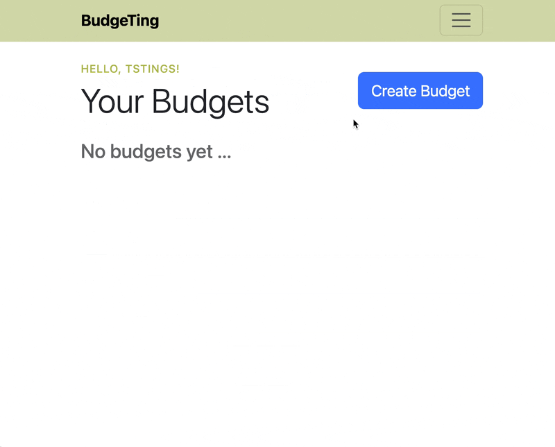

# $ BudgeTing $

_Full-Stack Budgeting App_

## Features

- **Multi-timeframe budgets** - Create, edit, and delete monthly or annual budgets
- **Income tracking** - Log gross income and view automatic calculations of expenses by category and net income after deductions
- **Expense management** - Create, update, and remove expenses across bills, savings, and debt categories
- **User authentication** - Secure signup/login with session management and error handling

## Demo

### User Authentication


### Budget Creation



### Error Handling


## Tech Stack

**Backend:** Python 3.12+, Flask, SQLAlchemy, Flask-Migrate  
**Database:** PostgreSQL  
**Testing:** unittest  
**Dev Tools:** Poetry  
**Frontend:** HTML, CSS, JavaScript _(currently minimal, focus is backend)_

## Deployment

This project ran in production on an AWS EC2 instance (us-west-2) with a custom domain pointed at it through Namecheap DNS. The instance has since been terminated to avoid ongoing hosting cost, so there is no live URL at the moment. The demo GIFs above show the app in use.

I chose EC2 over a managed host on purpose. It gives you a bare Linux machine and nothing else, so I had to set up every layer myself and see what a managed host normally does on your behalf.

### Production setup

**Scope**: A solo portfolio project with no meaningful traffic, which shaped several of the choices below.

**Host**: AWS EC2, provisioned and configured manually over SSH.

**App server**: Flask's built-in development server, run directly on the instance.

**Database**: PostgreSQL installed and configured on the same instance.

**Schema**: Alembic migrations applied against the production database with `poetry run app db-upgrade`.

**DNS**: Namecheap A record pointing the domain at the instance's public IP.

**Configuration**: `DATABASE_URL` and `SECRET_KEY` set as environment variables on the server. See `.env.sample` for the shape.

### What I would change

Getting it deployed and reachable was the goal, and it worked. Here is what I would do differently, in rough order of how much it matters:

- **Serve it over HTTPS.** The site ran on plain HTTP, so passwords and session cookies crossed the network in readable form.

  _Proposed fix:_ Put a reverse proxy in front of the app to handle TLS. Nginx with a Let's Encrypt certificate is the conventional pairing; Caddy is simpler since it renews certificates on its own. I would do this alongside the next item, since the proxy forwards to the app server.

- **Serve it with a production WSGI server.** I used Flask's built-in server, which prints a startup warning telling you not to. I ignored it since traffic was near zero, but the issue isn't only speed: it's single-threaded by default and makes no security or robustness guarantees.

  _Proposed fix:_ Flask's deployment docs list a few options. Gunicorn looks like the standard pick for Flask on Linux, so that's where I'd start.

- **Run it under a process manager.** I started the app by hand over SSH, so a crash or a reboot would have taken the site down until I noticed.

  _Proposed fix:_ A systemd service, so it starts at boot and restarts on failure.

- **Reconsider where I host it.** EC2 hands you a machine and leaves everything above it to you, which is why this list exists.

  _Next time:_ Platforms like Render, Railway, and Fly.io include HTTPS, restarts, and deploys from GitHub by default. I don't regret starting on EC2 since seeing the layers was the point, but I'd probably start there instead.

## Local Development

**Requirements:**

- Python 3.12+
- Poetry
- PostgreSQL

**First-time setup:**

1. Install project dependencies:

   ```shell
   poetry install
   ```

2. Start PostgreSQL and create the database (_see **PostgreSQL Setup** below_):

   ```shell
   createdb budget_db
   ```

3. Create your `.env` (_see **Environment Variables** below_):

   ```shell
   cp .env.sample .env
   ```

   Then edit `DATABASE_URL` to match your own PostgreSQL user and database.

4. Apply the existing migrations to build the schema:

   ```shell
   poetry run app db-upgrade
   ```

   > This repo already contains its migrations in `migrations/versions/`. You do **not** run `db-migrate` during setup — that command _generates_ a new migration from model changes, and on a fresh clone it has nothing to generate.

5. Start the server: `poetry run app start` (defaults to http://localhost:3000)

**Day-to-day:**

- Run the server: `poetry run app start`
- Run tests as you develop: `poetry run app test`
- After changing `models.py`, generate and apply a migration (_see **Database Migrations** below_)

### Dependency Management (Poetry)

This project uses [Poetry](https://python-poetry.org/docs/) for dependency management and packaging.

- Install the project and its dependencies into a virtualenv: `poetry install`
- Add a new dependency: `poetry add <package>`
- Run anything inside the virtualenv: `poetry run <command>`

Poetry creates the virtualenv for you; there is no need to make one by hand. The `app` command used throughout this README is the CLI entry point declared under `[tool.poetry.scripts]` in `pyproject.toml`, which is why it only exists after `poetry install`.

### PostgreSQL Setup (macOS + Homebrew)

1. Install [PostgreSQL](https://www.postgresql.org/).
2. Start the service: `brew services start postgresql@14` _replace postgresql@14 with your own version_
3. At initial setup, create the database: `createdb budget_db`

### Environment Variables

Create a `.env` file using `.env.sample` as a reference: `cp .env.sample .env`.

Required variables:

- **DATABASE_URL**:
  - Tells SQLAlchemy where your database lives and how to connect to it. Used by Flask when the app starts, and by Alembic during migrations.
  - `DATABASE_URL=postgresql://username:pw@localhost:5432/budget_db`
    - `username` your PostgreSQL role — on a Homebrew install this is usually your macOS username, not `postgres`
    - `:pw` your password, or omit the `:pw` entirely if your local setup has no password (e.g. `postgresql://audrey@localhost:5432/budget_db`)
    - `/budget_db` your database name
- **SECRET_KEY**:
  - Used by Flask to sign the session cookie and carry flash messages. Any non-guessable string works locally; use a real random value in production.
  - `SECRET_KEY=secret_key`, replace `secret_key` value with your own private key.
- **APP_PORT**:
  - Port the development server binds to. Defaults to `3000` in `.env.sample`.

#### Troubleshooting

**`FATAL: role "<name>" does not exist`** — a long SQLAlchemy/psycopg2 traceback ending in this line means `DATABASE_URL` names a PostgreSQL role that isn't on your machine. It is a config problem, not a broken install: the placeholder from `.env.sample` was left in place, or the username doesn't match your actual role. Fix the username in `.env` and re-run.

**`FATAL: database "<name>" does not exist`** — same idea, for the database half of the URL. Run `createdb budget_db`.

**`connection refused` on port 5432** — PostgreSQL isn't running. Start it (`brew services start postgresql@14`) and confirm with `pg_isready`.

### CLI Commands

This project provides a helper CLI exposed via Poetry to standardize common development tasks
(running the server, tests, and database migrations).

All commands should be run **from the project root** using:

```bash
poetry run app <command>
```

To see the command options/ description: `poetry run app -h`

- Contributors should prefer the CLI unless debugging internals. As fallback, use explicit path & commands: e.g `poetry run flask --app <path> <command>`

### Database Migrations

This project uses Flask-Migrate (Alembic) to manage schema changes.
[Flask-Migrate](https://flask-migrate.readthedocs.io/en/latest/) (which uses [Alembic](https://alembic.sqlalchemy.org/en/latest/tutorial.html) under the hood) tracks these schema changes.

**Migrations Usage:**

_Before you start, make sure PostgreSQL is running and verify your database exists._

- **Setting up a cloned repo:**

  The `migrations/` directory is committed, so there is nothing to initialize. Just apply what's already there:

  ```shell
  poetry run app db-upgrade
  ```

  - **Model definitions**: `models.py` (_i.e however your app organizes SQLAlchemy models_) holds the schema for the table structures, (user, budget, budget_item), to add to the db. Changes to these models require generating a new migration.

- **Generate a new migration** (_only after changing `models.py`_):

  ```shell
  poetry run app db-migrate -m "Note about new changes"
  ```

  _After generating migrations, commit the new files in the migrations/ directory so others and CI pick them up._

- **Apply migrations**:

  ```shell
  poetry run app db-upgrade
  ```

- **Rollback** (_optional_):

  ```shell
  poetry run app db-downgrade
  ```

  - Reverts the most recent migration (useful for testing or undoing structural changes).

- **View current migration history**:

  ```shell
  poetry run flask --app budget_app.app db history
  ```

  - Lists all migrations applied and pending, in chronological order.

- **Check which revision your database is currently at**:

  ```shell
  poetry run flask --app budget_app.app db current
  ```

  - Useful when you are unsure whether your local database is up to date with `migrations/versions/`.

### Running Tests

> [!NOTE]
> The test suite requires no database; service tests use in-memory SQLite.

The CLI internally invokes `unittest` with project-specific defaults. Explicit `__init__.py` files define the Python packages, which is what makes unittest discovery and absolute imports work.

Run **all tests** (with verbosity `-v`):

```shell
poetry run app test -v
```

Run a **specific test module**:

```shell
poetry run app test-module <module path here>
```

- testing `auth_test.py` example: `poetry run app test-module budget_app.routes.handlers.http.auth_test`

> [!NOTE]
> A future refactor may adopt [pytest](https://docs.pytest.org/en/stable/) for lighter-weight test discovery.

## License

This project is licensed under the MIT License. See the [LICENSE](LICENSE) file for details.

## Contributing

This is a portfolio project, feedback is welcome! Open an issue or submit a PR.

## Author

**Audrey** - [GitHub](https://github.com/audreycode6) | [LinkedIn](https://www.linkedin.com/in/audrey-theriault-allaire/)
